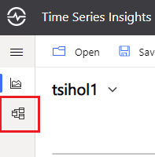

# TSI Model to Excel Importer/Exporter

Enables users to modify TSI model within Excel and deploy results back to TSI.

Two scripts are provided for this purpose:

* `Export-TSIModelToExcel.ps1`  : Exports TSI model data from JSON file(s) into Excel
* `Import-TSIModelFromExcel.ps1`: Imports data from Excel file into JSON file to be imported into TSI Model.

# Usage

Follow steps below to

## 1) Requirements

* Excel 2010 or later

* [Powershell]: https://docs.microsoft.com/en-us/powershell/scripting/install/installing-powershell?view=powershell-7.1	"Powershell v5 or later"

## 2) Export JSON metadata from Time Series Insights

You first need to export TSI model data from TSI Explorer

* Navigate to TSI Explorer URL
* Click on TSI Model icon
* 
* Click on "Instances" tab and "Download instances"
* Save "instances.json" file
* Click on "Hierarchies" tab and "Download hierarchies"
* Save "hierarchies.json" file
* Click on "Types" tab and "Download types"
* Save "types.json" file

## 2) Export JSON metadata into Excel

* Run `Export-TSIModelToExcel.ps1` 

USAGE: `Export-TSIModelToExcel.ps1  [OPTIONS]`

SAMPLE: `Export-TSIModelToExcel.ps1  -InstancesFile instances.json -HierarchiesFile hierarchies.json -TypesFile types.json -ModelFile TSIModel.xlsx`

OPTIONS: 
`​          -h, Help        : Display this screen.` 
`​          -InstancesFile  : Instances file exported from TSI. Default is 'instances.json'.` 
`​          -HierarchiesFile: Hierarchies file exported from TSI. Default is 'hierarchies.json'.` 
`​          -TypesFile      : Types file exported from TSI. Default is 'types.json'.` 
`​          -ModelFile      : Path to the output Excel file, to be modified and fed into 'Import-TSIModelFromExcel'. Default is 'TSIModel.xlsx'.` 

## 3) Update the model in Excel

### 3.1) Background
- Exported model in Excel includes following worksheets
  - `Instances` : Worksheet contains the list of instances, their types and names
  - `Instances (\<Hierarchy name\>)`: Excel workbook contains a separate sheet for each hierarchy that shows instances instances in that hierarchy
  - `Types`     : List of types. This sheet is only included for reference.
  - `Hirarchies`: List of hierarchies. This sheet is only included for reference.

- Updatable columns in each sheet is marked with yellow background.
- **timeSeries** column(s) are the key in each of "Intances*" sheets.
- **Instances** sheet has a line for each **timeSeriesId** which needs to be unique.  
- **Instances  (\<Hierarchy name\>)** sheets exist for each Hierarchy. These sheets contain typeId/Name, timeSeriesID, hierarchyId/Name and any instance fields for hierarchy.
- Import script processes sheets in order (left-to-right). If an attribute value (such as typeId or name) is null on any sheet, existing value is left unchanged. So that when you wan to update those attributes that exist in multiple sheets you can only update one and leave the rest "null".

### 3.2) Update existing instances/Change instance types
Update **typeId** or **name** columns in **Instances** sheet to update existing type definitions.

### 3.3) Add/remove new instances
Add/remove lines into **Instances** sheet. You can also add lines into any of **Instances  (\<Hierarchy name\>)** sheets to create an instance and include that in the hierarchy.

### 3.4) Add/remove new instances into hierarchy
Add/remove lines into/from related **Instances  (\<Hierarchy name\>)** sheets. Note that you have to repeat the same hierarchyId in each line added.

### 3.5) Update instances' placement within hierarchy
Modify **instance fields** (rightmost fields within worksheet after **hierarchy name**) within related **Instances  (\<Hierarchy name\>)** sheet.

### 3.6) Updated model file sample
See `TSIModel_sample.xlsx` as an example updated model file. Updated/added fields in each sheet is highlighted with blue color. An extra sheet (TimeSeriesIdMapping) is added to map each part of timeSeriesId into its labels.

## 4) Import TSI Model data from Excel into JSON
* Run `Export-TSIModelToExcel.ps1`

USAGE: `Export-TSIModelToExcel.ps1  [OPTIONS]`

SAMPLE: `Export-TSIModelToExcel.ps1  -InstancesFile instances_out.json -ModelFile TSIModel.xlsx`

OPTIONS: 
`​          -h, Help        : Display this screen.` 
`​          -InstancesFile  : Instances file created to be imported back into TSI. Default is 'instances_out.json'.` 
`​          -ModelFile      : Path to the input Excel file, created by 'Export-TSIModelToExcel'. Default is 'TSIModel.xlsx'.` 

## 5) Import TSI Model from JSON into TSI
The final step is to import modified instances json file back into TSI

You first need to export TSI model data from TSI Explorer

* Navigate to TSI Explorer URL
* Click on TSI Model icon
* 
* Click on "Instances" tab and "Upload JSON"
* Click "Choose file" and select instances.json file you created in step 4.
* Click "Upload"
